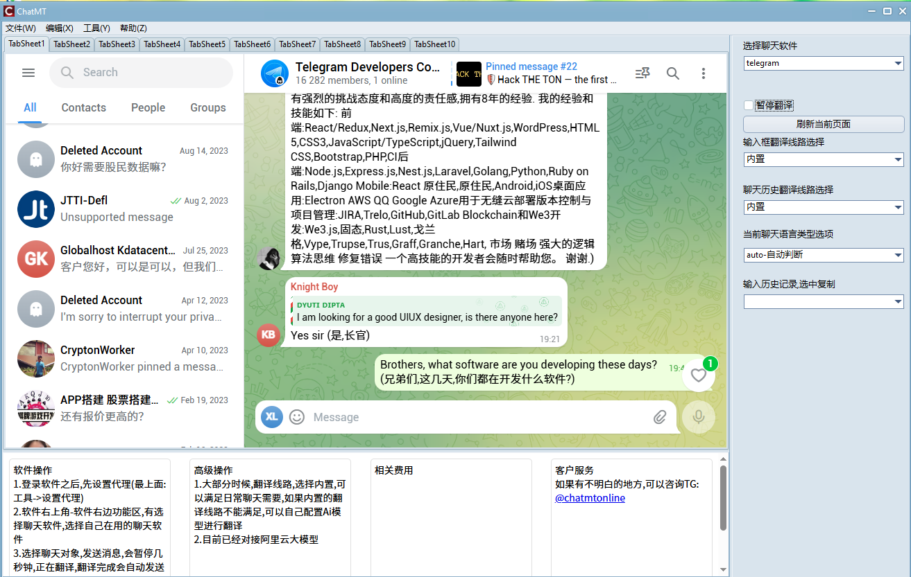

ChatMT聚合聊天翻译工具，专注于为出海企业提供高质量的WhatsApp/Telegram/LINE/FB Messenger等双向即时翻译服务,是跨境业务中首选聊天自动翻译助手。

翻译线路分为收费与免费两种选择:

如果您使用软件内置的翻译线路,需要支付少许费用,远低于其他翻译助手软件.可以节省80%以上开支;

如果你选择阿里云翻译线路,不需要为软件本身支付费用, 但是需要到阿里云官网,自行开通阿里云ai模型,把相关的授权key,填入软件,方可使用.

ChatMT安装使用说明

1.首先安装插件依赖项

浏览器webview2运行时插件
    
https://msedge.sf.dl.delivery.mp.microsoft.com/filestreamingservice/files/f2910a1e-e5a6-4f17-b52d-7faf525d17f8/MicrosoftEdgeWebview2Setup.exe

c++运行时插件

https://aka.ms/vs/17/release/vc_redist.x64.exe

net8运行时插件

https://builds.dotnet.microsoft.com/dotnet/aspnetcore/Runtime/8.0.19/dotnet-hosting-8.0.19-win.exe

2.接下来安装软件
     
ChatMTsetup.exe

3.安装好之后，在登录界面，点击设置 vpn，里面有设置vpn的说明

4.软件界面展示

